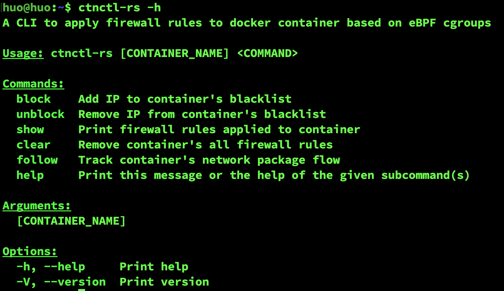
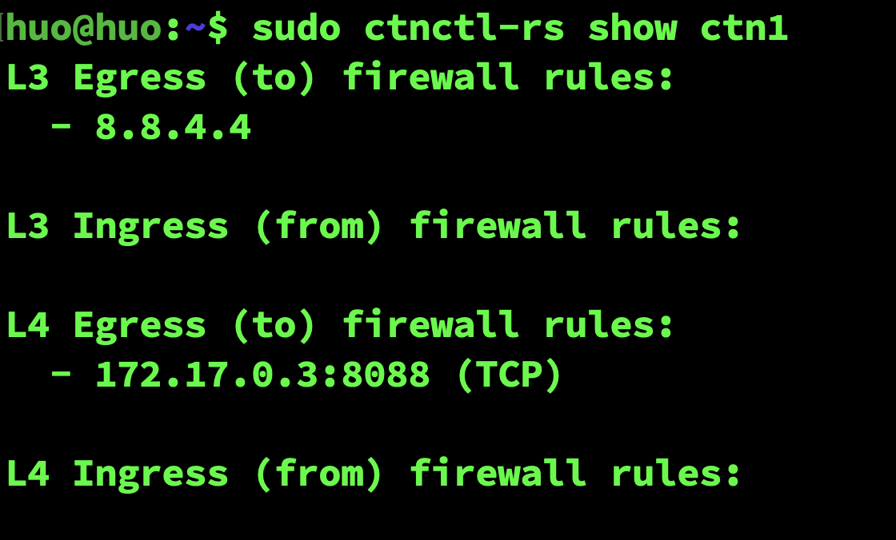
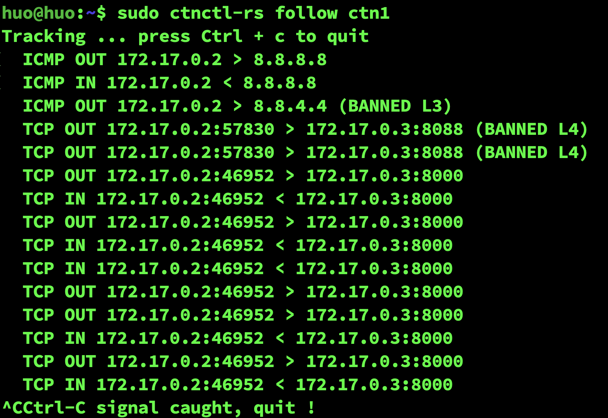

# ctnctl-rs
A CLI to apply firewall rules to docker container based on eBPF cgroups in Rust. 
- See the original Go version [here](https://github.com/ZhengjunHUO/ctnctl) based on cilium ebpf lib.

## Prerequis
```sh
# On Ubuntu 22.04.2
$ sudo apt install build-essential clang pkgconf zlib1g-dev libelf-dev libbpfcc libbpfcc-dev libbpf-dev llvm-dev systemtap-sdt-dev gcc-multilib
```
## Build
```
$ cargo build [--features "libbpf-cargo"]
```

## Usage


## Apply rule(s) to container
```
# Blacklist some remote connection for tcp/udp port on target container
$ sudo ./target/debug/ctnctl-rs block --from 172.17.0.2 --tcp 8000 ctn2
$ sudo ./target/debug/ctnctl-rs block --from 172.17.0.2 --udp 8088 ctn2
# Block container from visiting some external service
$ sudo ./target/debug/ctnctl-rs block --to 8.8.4.4 ctn1
$ sudo ./target/debug/ctnctl-rs block --to 172.17.0.3 --tcp 8088 ctn1
```

## Show container's active rule(s)


## Monitoring container's ingress/egress traffic
```
$ docker exec -ti ctn1 ping -c 1 8.8.8.8
$ docker exec -ti ctn1 ping -c 1 8.8.4.4
$ docker exec -ti ctn1 curl -m 3 172.17.0.3:8088
$ docker exec -ti ctn1 curl 172.17.0.3:8000
```


## Clean up rule(s)
```
# Remove certain rule applied to the container
$ sudo ./target/debug/ctnctl-rs unblock --to 8.8.4.4 ctn1

# Remove all rules applied to the container
$ sudo RUST_LOG=debug ./target/debug/ctnctl-rs clear ctn1

# When container doesn't exist
$ sudo ./target/debug/ctnctl-rs clear rust
Error: Container rust not found !
```

## Test UDP
```
# server up
$ nc -lup 8088
# contact server
$ echo -n "hello" | nc -u -w1 172.17.0.3 8088
```
